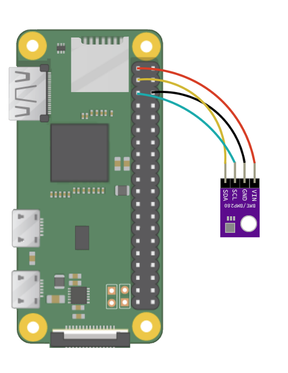

# `#growlab` app for Raspberry Pi

Record a timelapse and live preview image with sensor data from a Bosch BME280 or BMP280 sensor

* The BME280 costs slightly more and measures: temperature, humidity and air pressure.
* The BMP can only measure temperature and air pressure.


> Example HTML output which can be synced to GitHub Pages, an S3 bucket, or served directly from the RPi using [inlets](https://docs.inlets.dev/)

See also: [app roadmap](https://github.com/alexellis/growlab/issues/15)

## Assembling the build

* You'll need a Raspberry Pi Zero W or any other Raspberry Pi.
* An RPi camera connected - any version
* A Bosch BME280 or BMP280 sensor connected to GND, VCC SDL and SCL.


> How to connect the sensor over i2c

### Configuring the RPi

Using `raspi-config`

* Set your hostname such as `growpi`
* Enable i2c under interfacing options
* Change the password for the `pi` user

### Getting started with the software

Install git, tmux, Python and font pages

```bash
sudo apt update -qy && \
  sudo apt install -qy python3 \
  i2c-tools \
  python3-pip \
  git \
  tmux \
  libopenjp2-7 \
  libopenjp2-7-dev \
  libopenjp2-tools
```

> The `libopenjp2` package is for overlaying text on top of the images.

Clone the repo:

```bash
git clone https://github.com/alexellis/growlab
cd growlab/app
```

Get the roboto font:

```bash
curl -sSL https://github.com/googlefonts/roboto/releases/download/v2.138/roboto-unhinted.zip -o roboto.zip
unzip roboto.zip -d roboto
```

Install Python modules with `pip3`:

```bash
sudo pip3 install -r requirements.txt
```

Capture a test image to determine if you need a horizontal or vertical flip or not:

```bash
# On the RPi
raspistill -o growlab.jpg

# From your PC:
scp pi@growlab.local:~/growlab.jpg Desktop/

# On a Mac:
open Desktop/growlab.jpg

# On a Linux desktop:
xdg-open Desktop/growlab.jpg
```

If needed, test again with `-vf` or `-hf` to flip the image.

Edit the `config.json` file if needed and update the flip settings, and width and height to match the file that you got from your test `growlab.jpg` image.

```json
{
    "images": {
        "output_dir": "./images/",
        "encoding": "jpeg",
        "width": 2592,
        "height": 1944,
        "image_quality": 70,
        "preview_seconds": 1,
        "vertical_flip": false,
        "horizontal_flip": false,
        "interval_seconds": 600
    },
    "text": {
        "colour": {
            "red": 255,
            "green": 255,
            "blue": 255
        },
        "size": 48
    }
}
```

Capture a test photo and HTML page. You'll see the files generated in the `html` folder as `image.jpg` and `index.html`.

```bash
python3 app.py
```

If you have no sensors, then run:

```bash
export SENSOR_TYPE=none
python3 app.py
```

If you have the BMP280, then run this instead:

```bash
export SENSOR_TYPE=bmp280
python3 app.py
```

### Serve a preview with GitHub pages

Configure GitHub pages and / or a custom domain using the CNAME approach

Set the folder for serving content to "docs"

Generate an SSH key:

```bash
cd growlab/app
mkdir -p .ssh

ssh-keygen -f `pwd`/.ssh/id_rsa
```

Remove the HTTPS git remote and add a SSH one, changing "alexellis" to your own name.

```bash
git remote rm origin
git remote add origin git@github.com:alexellis/growlab.git
```

Go to the repo settings and add the deploy key and check *Allow write access*

Now run the sample.sh bash script. Feel free to view its contents to see how it works

```bash
cd growlab/app

./sample.sh
```

You can also put this into a loop to run every 10 minutes:

```bash
while [ true ] ; do ./sample.sh && echo "waiting 10 minutes" && sleep 600 ; done 
```

### Install growlab as a service

Install the systemd service:

```bash
touch /etc/default/growlab
sudo cp growlab.service /etc/systemd/system
sudo systemctl enable growlab
sudo systemctl start growlab
```
